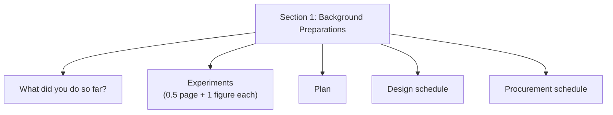
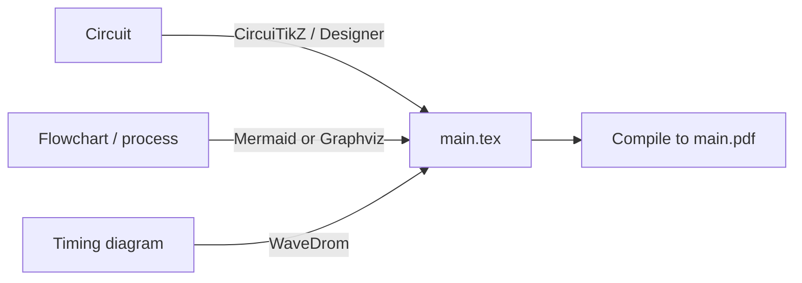

# ELL305 — Project Guide

*only for project people, with deadlines and information etc, see the [main README](./README.md).*

[⬅ Back to README](./README.md) &nbsp;·&nbsp; [Sources](./sources)

---

## Table of Contents

- [Draft 1 — Section 1 Content](#draft-1--section-1-content)
- [Experiment Write-Up Format](#experiment-write-up-format)
- [Recommended Diagram Tooling](#recommended-diagram-tooling)
- [Sources for This Guide](#sources-for-this-guide)

---

## Draft 1 — Section 1 Content

Per Prof. Subrat Kar, Draft 1 for the **Project** covers, *inter alia*: (btw inter alia means 'among other things')

1. **What has been done so far**
2. **Description of experiments** — 0.5 page each, with **one figure per experiment**
3. **Plan** going forward
4. **Design schedule**
5. **Procurement schedule**

> Codes belong in an **Appendix**, syntax-highlighted, so they don't distract from the narrative.

---

## Experiment Write-Up Format

Since Project Reports are **single-authored**, each experiment should be documented tightly and consistently. Suggested per-experiment structure (≈0.5 page):

| Element | Content |
|---|---|
| Objective | One line — what the experiment tests/builds |
| Setup | Brief description, illustrated with **one figure** (circuit diagram / photo / block diagram) |
| Result | What was observed / measured |
| Status | % complete, blockers if any |

---

## Recommended Diagram Tooling

Per Head TA Utkarsh Roy's Draft 1 instructions (these apply to the Project track's illustration needs — the Term Paper has its own stricter mandatory list, see [TERM_PAPER.md](./TERM_PAPER.md#mandatory-tooling)):

| Purpose | Tool | Link |
|---|---|---|
| Circuit diagrams | CircuiTikZ | [User Manual (PDF)](https://circuitikz.github.io/circuitikz/circuitikzmanualgit.pdf) |
| Circuit diagram GUI (export to CircuiTikZ/SVG) | CircuiTikZ Designer | [circuit2tikz.tf.fau.de](https://www.circuit2tikz.tf.fau.de/designer/) |
| Flowcharts / process diagrams | Mermaid | [mermaid.ai/open-source/intro](https://mermaid.ai/open-source/intro/) |
| General graph diagrams | Graphviz | [graphviz.org](https://graphviz.org/) |
| Digital timing diagrams | WaveDrom | [wavedrom.com](https://wavedrom.com/) |

> ⚠️ When using CircuiTikZ Designer, remember to switch the design style from **American** to **European**.

---

## Sources for This Guide

| Source | Sender |
|---|---|
| [Draft 1 instructions](./sources/02-utkarsh-draft1-instructions.md) | Utkarsh Roy (Head TA) |
| [Draft 1 tips](./sources/03-subrat-kar-draft1-tips.md) | Prof. Subrat Kar |

[⬅ Back to README](./README.md)

