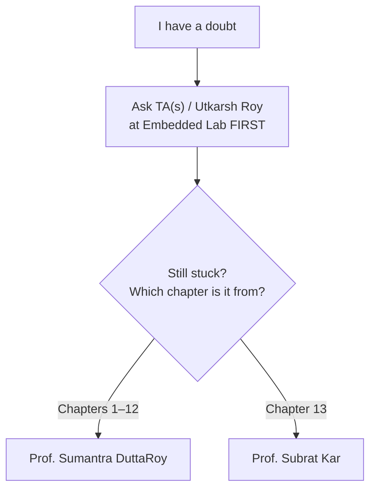
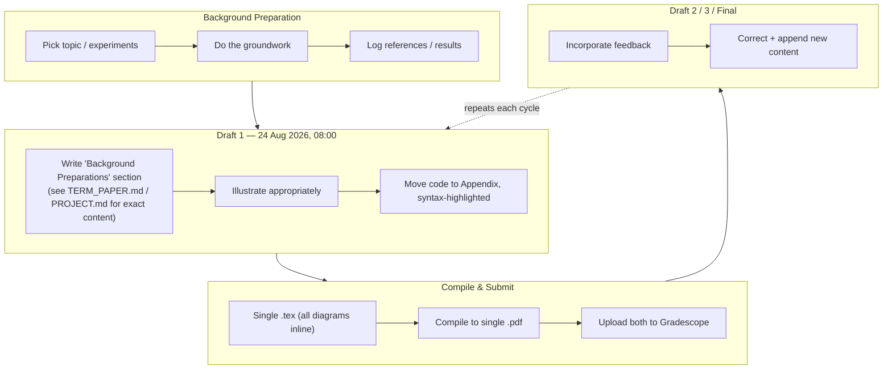

# ELL305 — Term Paper / Project

### Consolidated Instructions, Schedule & Submission Guide

*general rules and shit. project/termpaper specific is below*

*ALSO NOTE I MADE TS FOR MYSELF AND SOME OF MY PEERS SO IF YOU ARE USING IT CROSS CHECK EVERY INFORMATION WITH SOMEONE IDK*

**[Term Paper Guide →](./TERM_PAPER.md)** &nbsp;·&nbsp; **[Project Guide →](./PROJECT.md)** &nbsp;·&nbsp; **[Sources →](./sources)**

---
# UPCOMING DEADLINE - 24th AUG 8AM MORNING GET TO WORK AHHHHHHHHHHHH

## contents

- [overview](#overview)
- [submission rules for ALL drafts](#submission-rules)
- [doubts](#doubts)
- [DRAFT 1](#draft-1)
- [sources](#sources)

---

## Overview

| Item | Detail |
|---|---|
| Submission Platform | [Gradescope](https://gradescope.com) |
| Textbook | [Sarangi — Computer Architecture (archbook.pdf)](https://srsarangi.github.io/archbook/archbook.pdf) |
| Authorship | Term Paper: teams of 1–360 · Project Report: single author only |
| Files per submission | Exactly **2** — one `.tex` source + one compiled `.pdf` |

> Each submission is **cumulative**: everything corrected in Draft *n* (based on feedback) carries forward into Draft *n+1*, plus new content is added.

---

## Submission Rules

Every submission (including Draft 1) requires **two, and only two, files** — this applies identically to Term Paper and Project:

1. **A single LaTeX file** containing *all* diagrams, graphs/plots, flowcharts, and circuit diagrams inline — no second `.tex` file, no auxiliary asset files, **no `.zip`**
2. **A single PDF file** — must be reproducible by compiling file (1) above

---

## Doubts

(no idea why it created a fucking chart for this but ill take it)
> Heads up: the first question either professor will ask is *"What did the TAs / Utkarsh say?"* — so always route through the TAs first.
 
**TA Contacts:**
 
| TA | Email |
|---|---|
| Utkarsh Roy (Head TA) | [eez238339@iitd.ac.in](mailto:eez238339@iitd.ac.in) |
| Garima Singhal | [eez238573@ee.iitd.ac.in](mailto:eez238573@ee.iitd.ac.in) |
---

## DRAFT 1

Per Prof. Subrat Kar: Draft 1 is explicitly a **progress report**, not a preliminary version of the final paper. Per Head TA Utkarsh Roy, it must include a section titled **"Background Preparations"** describing the work completed so far, appropriately illustrated (circuit diagrams, flowcharts, figures, code snippets as needed).

The exact content of the "Background Preparations" section **differs** for Term Paper vs. Project — see the respective guide.

---

## Sources

Every instruction in this README and in `TERM_PAPER.md` / `PROJECT.md` is paraphrased/organized from the original communications below, kept verbatim so you can cross-check:

| # | Source | Sender | Applies to |
|---|---|---|---|
| 1 | [Submission logistics email](./sources/subrat_mail_17thAug.md) | Course communication | Both |
| 2 | [Draft 1 instructions](./sources/utkarsh_teams_20thAug.md) | Utkarsh Roy (Head TA) | Both |
| 3 | [Draft 1 tips](./sources/subrat_teams_21stAug.md) | Prof. Subrat Kar | Project |
| 4 | [Mandatory tooling email](./sources/garima_mail_21stAug.md) | Garima Singhal (TA) | Term Paper |

---

*This README consolidates official course communications for ELL305. Always cross-check against the original email/Gradescope announcements for any updates.*

