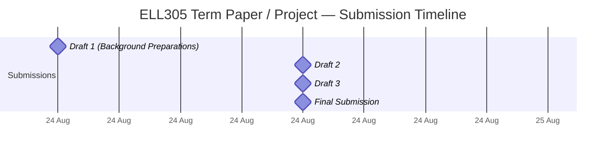
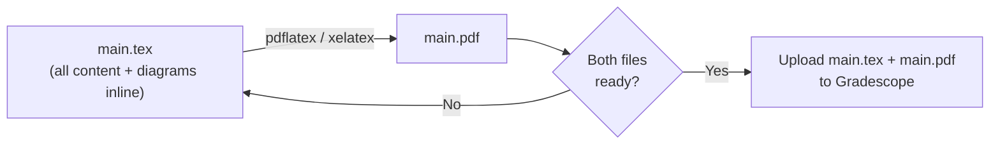
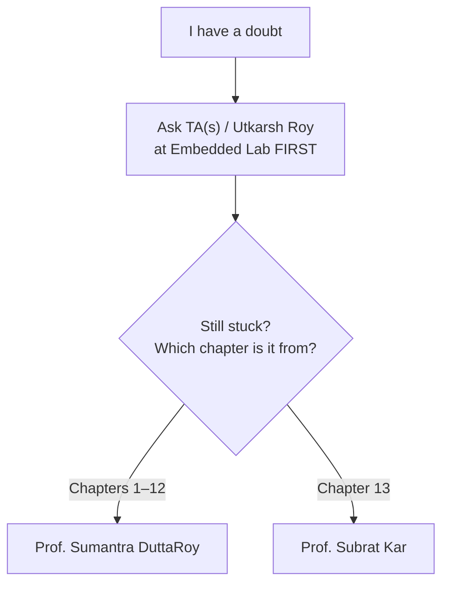
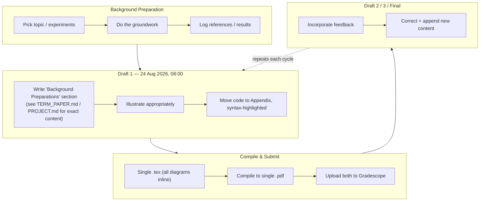

<div align="center">

# ELL305 — Term Paper / Project

### Consolidated Instructions, Schedule & Submission Guide


*General, shared rules that apply to **both** the Term Paper and the Project track. For track-specific instructions, jump to the right guide below.*

**[📄 Term Paper Guide →](./TERM_PAPER.md)** &nbsp;·&nbsp; **[🔧 Project Guide →](./PROJECT.md)** &nbsp;·&nbsp; **[📁 Sources →](./sources)**

</div>

---

## Table of Contents

- [Which Guide Do I Need?](#which-guide-do-i-need)
- [Overview](#overview)
- [Submission Schedule](#submission-schedule)
- [File Submission Rules](#file-submission-rules)
- [Doubt Resolution — Who to Ask](#doubt-resolution--who-to-ask)
- [What Draft 1 Actually Is](#what-draft-1-actually-is)
- [Repository / Local Structure](#repository--local-structure)
- [Sources](#sources)

---

## Which Guide Do I Need?

| You are writing... | Go to |
|---|---|
| A **Term Paper** (teams of 1–360 allowed) | **[TERM_PAPER.md](./TERM_PAPER.md)** |
| A **Project Report** (single author only) | **[PROJECT.md](./PROJECT.md)** |

Everything common to both — deadlines, file rules, doubt resolution — stays here in the README so it isn't duplicated.

---

## Overview

| Item | Detail |
|---|---|
| Course | ELL305 |
| Deliverable | Term Paper **or** Project Report (four cumulative submissions: 3 drafts + 1 final) |
| Submission Platform | [Gradescope](https://gradescope.com) |
| Textbook | [Sarangi — Computer Architecture (archbook.pdf)](https://srsarangi.github.io/archbook/archbook.pdf) |
| Authorship | Term Paper: teams of 1–360 · Project Report: single author only |
| Files per submission | Exactly **2** — one `.tex` source + one compiled `.pdf` |

> Each submission is **cumulative**: everything corrected in Draft *n* (based on feedback) carries forward into Draft *n+1*, plus new content is added.

---

## Submission Schedule



> Only Draft 1's date (**24 Aug 2026, 08:00**) has been announced so far. Update this chart as later deadlines are shared.

---

## File Submission Rules

Every submission (including Draft 1) requires **two, and only two, files** — this applies identically to Term Paper and Project:

1. **A single LaTeX file** containing *all* diagrams, graphs/plots, flowcharts, and circuit diagrams inline — no second `.tex` file, no auxiliary asset files, **no `.zip`**
2. **A single PDF file** — must be reproducible by compiling file (1) above



---

## Doubt Resolution — Who to Ask



> Heads up: the first question either professor will ask is *"What did the TAs / Utkarsh say?"* — so always route through the TAs first.

---

## What Draft 1 Actually Is

Per Prof. Subrat Kar: Draft 1 is explicitly a **progress report**, not a preliminary version of the final paper. Per Head TA Utkarsh Roy, it must include a section titled **"Background Preparations"** describing the work completed so far, appropriately illustrated (circuit diagrams, flowcharts, figures, code snippets as needed).



The exact content of the "Background Preparations" section **differs** for Term Paper vs. Project — see the respective guide.

---

## Repository / Local Structure

```
ell305/
├── README.md              # this file — shared rules, not submitted
├── TERM_PAPER.md            # term-paper-specific instructions
├── PROJECT.md                # project-specific instructions
├── sources/                   # verbatim original emails, for cross-checking
│   ├── 01-submission-logistics-email.md
│   ├── 02-utkarsh-draft1-instructions.md
│   ├── 03-subrat-kar-draft1-tips.md
│   └── 04-garima-singhal-term-paper-tooling-email.md
├── main.tex                   # THE single file actually submitted
├── main.pdf                    # THE compiled second file submitted
└── references.bib               # BibTeX export from Zotero
```

---

## Sources

Every instruction in this README and in `TERM_PAPER.md` / `PROJECT.md` is paraphrased/organized from the original communications below, kept verbatim so you can cross-check:

| # | Source | Sender | Applies to |
|---|---|---|---|
| 1 | [Submission logistics email](./sources/01-submission-logistics-email.md) | Course communication | Both |
| 2 | [Draft 1 instructions](./sources/02-utkarsh-draft1-instructions.md) | Utkarsh Roy (Head TA) | Both (general) |
| 3 | [Draft 1 tips](./sources/03-subrat-kar-draft1-tips.md) | Prof. Subrat Kar | Both (split by section) |
| 4 | [Mandatory tooling email](./sources/04-garima-singhal-term-paper-tooling-email.md) | Garima Singhal (TA) | Term Paper **only** |

---

<div align="center">

*This README consolidates official course communications for ELL305. Always cross-check against the original email/Gradescope announcements for any updates.*

</div>
