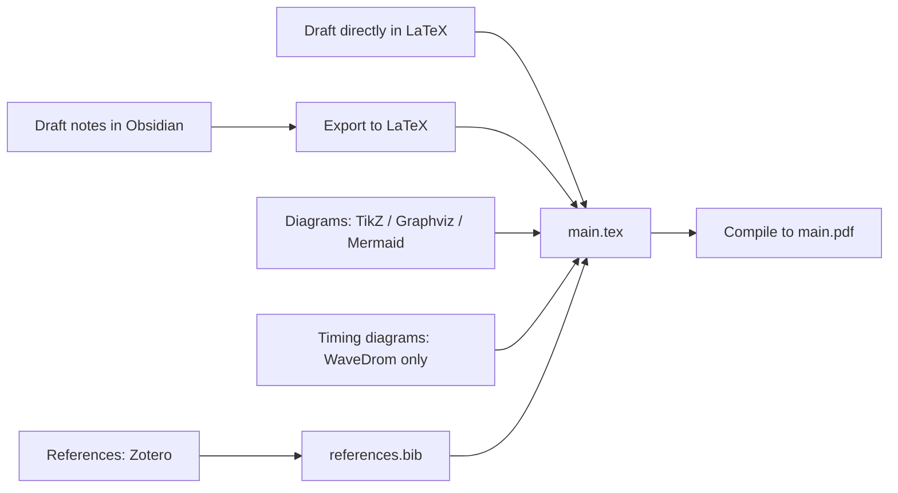

# ELL305 — Term Paper Guide

*Term-paper-specific content only. For shared deadlines, file rules, and doubt resolution, see the [main README](./README.md).*

[⬅ Back to README](./README.md) &nbsp;·&nbsp; [Sources](./sources)

---

## Table of Contents

- [Draft 1 — Section 1 Content](#draft-1--section-1-content)
- [Progress Gantt Chart](#progress-gantt-chart)
- [Mandatory Tooling](#mandatory-tooling)
- [Draft Evaluation Policy](#draft-evaluation-policy)
- [Sources for This Guide](#sources-for-this-guide)

---

## Draft 1 — Section 1 Content

Per Prof. Subrat Kar, Draft 1 for the **Term Paper** is written as **"Section 1: Work done as of 24 Aug 2026"**, covering:

1. **Chosen topic** — what is it
2. **Chapter mapping** — how the topic maps to a chapter in the textbook
3. **Advising professor** — Prof. Sumantra DuttaRoy (Chapters 1–12) *or* Prof. Subrat Kar (Chapter 13), per the [doubt-resolution rule](./README.md#doubt-resolution--who-to-ask)
4. **Progress Gantt chart** (drawn in LaTeX) — see breakdown below
5. Further tasks / work packages as relevant to the topic

> Codes belong in an **Appendix**, syntax-highlighted, so they don't distract from the narrative (per Prof. Subrat Kar's general note).

---

## Progress Gantt Chart

Suggested Work Package breakdown for the Draft 1 Gantt chart:

```mermaid
gantt
    title Term Paper — Suggested Work Package Breakdown
    dateFormat  X
    axisFormat  %

    section WP1
    Task 1 - Read basic chapter(s)         : t1, 0, 100
    Task 2 - Read papers, log in Zotero    : t2, 0, 100

    section WP2
    Task 3 - Cite references read so far   : t3, 0, 100
```

| Work Package | Task | Description |
|---|---|---|
| **WP1** | Task 1 | Read the basic chapter(s) titled "\_\_\_" from the textbook — track **% done** |
| **WP1** | Task 2 | Read papers related to the topic; store references/PDFs in **Zotero**, shared with Prof. Subrat Kar |
| **WP2** | Task 3 | Cite all references read so far |

---

## Mandatory Tooling

Per TA Garima Singhal's email (21 Aug 2026), the following tooling is **mandatory** for the Term Paper — this is stricter than the general Draft 1 suggestions in the README:

| Purpose | Required Tool | Notes |
|---|---|---|
| Drafting / note-taking | **Obsidian** | Required for drafting, note-taking, and organizing research in Markdown |
| Standard diagrams & flowcharts | TikZ (LaTeX), Graphviz, or Mermaid | Any of the three |
| Multi-language diagrams | Text-to-Diagram (text-to-diag) tools | Optional, supports multiple markup/programming languages |
| Waveforms & timing diagrams | **WaveDrom exclusively** | No other tool permitted for this category |
| Bibliography & citations | **Zotero exclusively** | Must be used to generate the final `.bib` (BibTeX) file |

> **On Obsidian vs. LaTeX:** Obsidian/Zettlr is easier to start with and exports directly to LaTeX. Many students will use Obsidian + LaTeX together, but **LaTeX-only is also a valid choice**.

---

## Draft Evaluation Policy

Per TA Garima Singhal: any **preliminary/milestone draft** (e.g. Draft 1) is evaluated **independently** and is **not related** to the final term paper submission's grading — but per the [main README](./README.md#overview), the *content* is still cumulative (Draft 1's material carries into later drafts).

---

## Sources for This Guide

| Source | Sender |
|---|---|
| [Draft 1 tips](./sources/03-subrat-kar-draft1-tips.md) | Prof. Subrat Kar |
| [Mandatory tooling email](./sources/04-garima-singhal-term-paper-tooling-email.md) | Garima Singhal (TA) |

[⬅ Back to README](./README.md)

